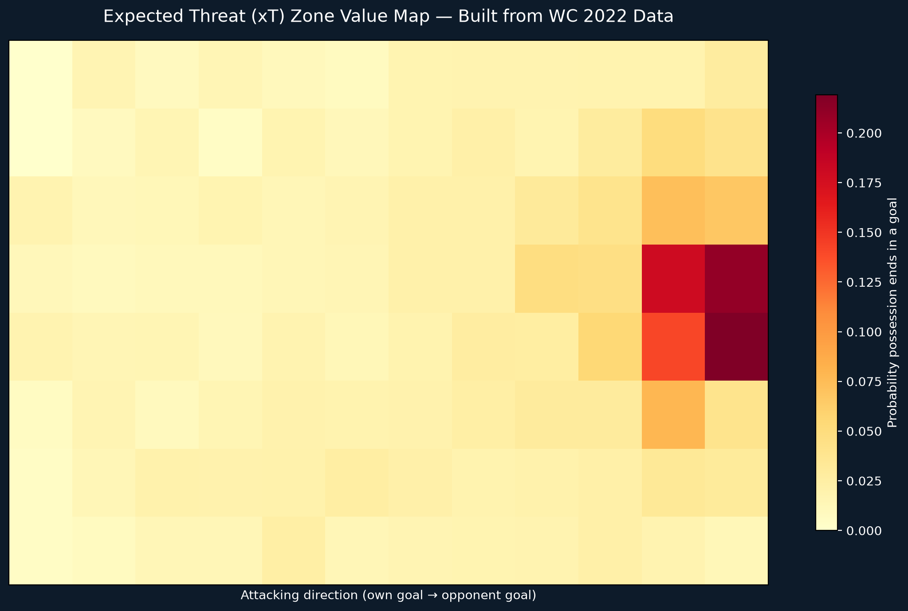
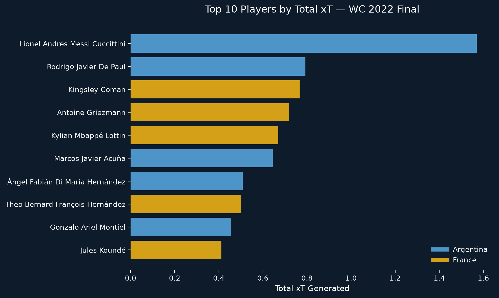

# Expected Threat (xT) Model — Built from Scratch

Building a working Expected Threat model using real World Cup 2022 data, then applying it to value every pass and carry in the tournament final, not just shots.

## Why this project
Goals and assists only capture the final action of a sequence. Expected Threat values every step that built the chance, passing and carrying included, by measuring how much each action increased the probability of a goal. This project builds the model from scratch rather than using a pre-built one, calculating real zone values from 64 World Cup 2022 matches.

## What it does
- Pulled event data from all 64 matches of the 2022 World Cup (234,637 total events)
- Divided the pitch into a 12x8 zone grid using fixed coordinates
- Calculated, for each zone, the historical probability that a possession passing through it ended in a goal
- Applied the resulting value map to score every pass and carry in the Argentina vs France Final, based on the change in zone value from start to end location

## Key findings
- The zone value map correctly shows danger increasing toward the opponent's goal and concentrating centrally, matching real football intuition
- Corner kicks scored among the highest individual xT values in the match, since they move the ball from a wide, low-value position (the corner flag) into the most dangerous central zone in front of goal, even though the x-coordinate technically decreases
- Messi generated the highest total xT in the final (1.57), nearly double the next-highest player (Rodrigo De Paul, 0.79), consistent with his Golden Ball-winning tournament
- Kylian Mbappé, despite scoring a hat-trick in the same match, ranked only 5th in total xT (0.67), a reminder that xT measures buildup and progression value, not finishing quality

## Why this matters
This shows how a player's real attacking contribution can be very different from their goals and assists column. A player generating consistent progression value (like Messi) may never appear on a highlight reel finishing a chance, but is doing the work that creates the danger in the first place.

## Visuals

## Tools used
Python, pandas, matplotlib, statsbombpy

## Data source
StatsBomb Open Data — https://github.com/statsbomb/open-data (World Cup 2022, all 64 matches for model training; Final match for scoring)
